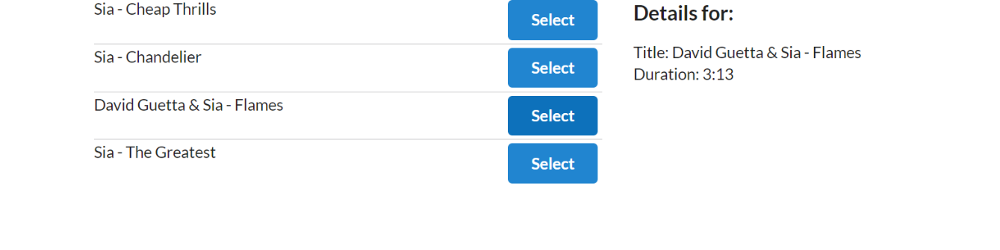

# react-redux

Terminal -> cd <project dir/proj> -> create-react-app <proj-name>

- Start app: npm start
- Stop app: Ctrl + c
- localhost:3000

semantic ui cdn:
- https://semantic-ui.com/
- https://cdnjs.com/libraries/semantic-ui

Add in head tag:
 - https://cdnjs.cloudflare.com/ajax/libs/semantic-ui/2.4.1/semantic.min.css

npm install --save faker
- https://github.com/marak/Faker.js/ 

-----------

